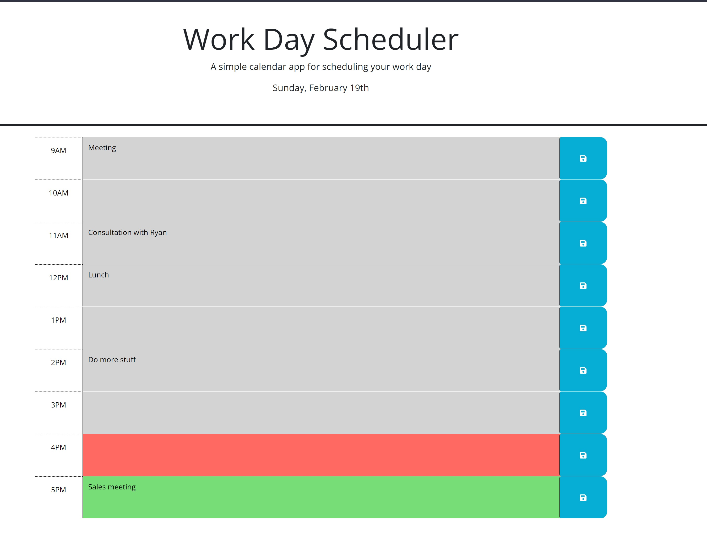

# Challenge-05 Third-Party APIs: Work Day Scheduler


```md
A Work Day Scheduler is a simple calendar application that allows a user to 
save events for each hour of the day by modifying starter code. This app 
will run in the browser and feature dynamically updated HTML and CSS powered by jQuery.

Calendar uses the [Day.js](https://day.js.org/en/) library to work with date and time.

AN idividual with a busy schedule can add important events to a daily planner
so that one can manage the time effectively.
```





[Work Day Scheduler Website](https://00rest.github.io/Challenge-05-Third-Party-APIs/)


```md
When you are using a daily planner to create a schedule
You can open the planner
THEN the current day is displayed at the top of the calendar

WHEN you scroll down
THEN, you are presented with timeblocks for standard business hours

WHEN you view the timeblocks for that day
THEN each timeblock is color coded to indicate whether it is in the past, present, or future

WHEN you click into a timeblock
THEN you can enter an event

WHEN you click the save button for that timeblock
THEN the text for that event is saved in local storage

WHEN you refresh the page
THEN the saved events persist
```